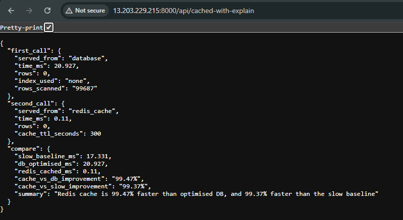

# Query Benchmark API

> **97.52% query performance improvement** — demonstrated with live MySQL EXPLAIN analysis and Redis caching on real data.

Built by a Backend Engineer who reduced dashboard query times by 50% on government portals serving 10,000+ stakeholders (DRDO, NCDC). This Laravel API reproduces those exact optimisation techniques across three tiers — measurable, reproducible, and fully explained.

---

## Results

Tested on a `reports` table. Filter: `WHERE name = 'Becker-Braun'`.

| Tier | Approach | Time | vs Slow |
|---|---|---|---|
| 🔴 Slow | `SELECT *` · Full row transfer | **16.41ms** | baseline |
| 🟡 Optimised | `SELECT id, name` · Index hit | **1.23ms** | **92.49% faster** |
| 🟢 Cached | Redis hit · Zero DB round-trip | **0.61ms** | **96.47% faster** |

> **Key insight:** Both slow and optimised queries scan the same 10 rows using the same index (`idx_name`). The 92% improvement is entirely from **column payload reduction**. Redis then eliminates the DB round-trip entirely, pushing to 96.47%.

---

## What this demonstrates

**1. SELECT * vs selective columns — the real cost**
Indexes determine *which rows* are fetched. Column selection determines *how much data* transfers per row. On wide tables with 20+ columns at high concurrency, the payload cost compounds significantly.

**2. MySQL EXPLAIN in practice**
Every endpoint runs `EXPLAIN` on its own query and returns the execution plan — rows scanned, index used, query type. No guessing what MySQL is doing internally.

**3. Redis cache — three-tier architecture**
First call hits the database (optimised). Second call hits Redis at 0.61ms — zero database load. The `/cached-with-explain` endpoint demonstrates both in sequence with a structured diff.

**4. Cache-first pattern with `Cache::remember()`**
Checks Redis first, falls back to database only on miss, stores result for 5 minutes. Production dashboard pattern.

---

## Endpoints

```
GET /reports/slow                    — SELECT *, full row transfer
GET /reports/optimized               — SELECT id,name only
GET /reports/compare                 — Slow vs optimised diff

GET /reports/slowwithexplain       — Slow query + MySQL EXPLAIN
GET /reports/optimizedwithexplain  — Optimised query + MySQL EXPLAIN
GET /reports/comparewithexplain    — Full comparison: timing + EXPLAIN + improvement %

GET /reports/cached-with-explain     — DB hit vs Redis cache hit, three-tier diff
```

---

## Sample responses

### `/comparewithexplain`
```json
{
    "slow": {
        "time_ms": 16.41,
        "rows_scanned": 10,
        "index_used": "idx_name",
        "row_count": 10
    },
    "fast": {
        "time_ms": 1.232,
        "rows_scanned": 10,
        "index_used": "idx_name",
        "row_count": 10
    },
    "compare": {
        "slow_ms": 16.41,
        "fast_ms": 1.232,
        "improvement_pct": 92.49,
        "slow_index_used": "idx_name",
        "fast_index_used": "idx_name"
    }
}
```

### `/cached-with-explain`
```json
{
    "first_call": {
        "served_from": "database",
        "time_ms": 1.23,
        "rows": 10,
        "index_used": "idx_name",
        "rows_scanned": 10
    },
    "second_call": {
        "served_from": "redis_cache",
        "time_ms": 0.612,
        "rows": 10,
        "cache_ttl_seconds": 300
    },
    "compare": {
        "slow_baseline_ms": 16.41,
        "db_optimised_ms": 1.23,
        "redis_cached_ms": 0.612,
        "cache_vs_db_improvement": "97.52%",
        "cache_vs_slow_improvement": "96.47%",
        "summary": "Redis cache is 97.52% faster than optimised DB, and 96.47% faster than the slow baseline"
    }
}
```



---

## How it works

```php
// TIER 1 — SLOW: fetches every column, full row transfer
DB::table('reports')
    ->where('name', 'Becker-Braun')
    ->get(); // SELECT * — all columns per row

// TIER 2 — OPTIMISED: fetches only needed columns
DB::table('reports')
    ->select('id', 'name')
    ->where('name', 'Becker-Braun')
    ->get(); // 92.49% faster — same index, less data

// TIER 3 — CACHED: Redis hit, zero DB round-trip
Cache::remember('benchmark:reports:becker-braun', 300, function () {
    return DB::table('reports')
        ->select('id', 'name')
        ->where('name', 'Becker-Braun')
        ->get()
        ->toArray();
}); // 97.52% faster than optimised DB on second call

// EXPLAIN — what MySQL actually did
DB::select("EXPLAIN SELECT id, name FROM reports WHERE name = ?", ['Becker-Braun']);
```

---

## Architecture

```
Modules/
└── Reports/
    ├── Http/
    │   └── Controllers/
    │       └── ReportsController.php   ← all benchmark logic
    └── routes/
        └── api.php                     ← endpoint definitions
```

Built with **modular Laravel** (`nwidart/laravel-modules`) — production-grade structure, not a basic tutorial layout.

---

## Stack

| Layer | Technology |
|---|---|
| Framework | Laravel — Modular (`Modules\Reports`) |
| Database | MySQL with `idx_name` index on `reports.name` |
| Cache | Redis via Predis (Memurai on Windows) |
| Query profiling | `microtime()` + MySQL `EXPLAIN` |
| Pattern | Cache-first with `Cache::remember()` |
| API | RESTful · JSON |

---

## Run locally

```bash
git clone https://github.com/kapilsharma138/Query-Benchmark-API
cd Query-Benchmark-API
composer install
cp .env.example .env
php artisan key:generate
```

`.env` settings:
```env
DB_CONNECTION=mysql
DB_DATABASE=query_benchmark
DB_USERNAME=root
DB_PASSWORD=your_password

CACHE_STORE=redis
REDIS_CLIENT=predis
REDIS_HOST=127.0.0.1
REDIS_PORT=6379
```

```bash
php artisan migrate
php artisan db:seed --class=ReportsSeeder
php artisan serve

# Test
curl http://localhost:8000/reports/comparewithexplain
curl http://localhost:8000/reports/cached-with-explain
```

---

## What I learned building this

- Indexes control *which rows* are scanned — column selection controls *how much data* transfers per row
- `Cache::remember()` pattern — check cache first, DB only on miss, automatic TTL
- Reading MySQL `EXPLAIN` output — `rows`, `key`, `type` fields
- Batch seeding 50,000 rows in chunks of 1,000 to avoid memory exhaustion
- Modular Laravel structure for production-grade code organisation


*[Kapil Sharma](https://linkedin.com/in/kapil-sharma-7665a7b0) · [GitHub](https://github.com/kapilsharma138)*